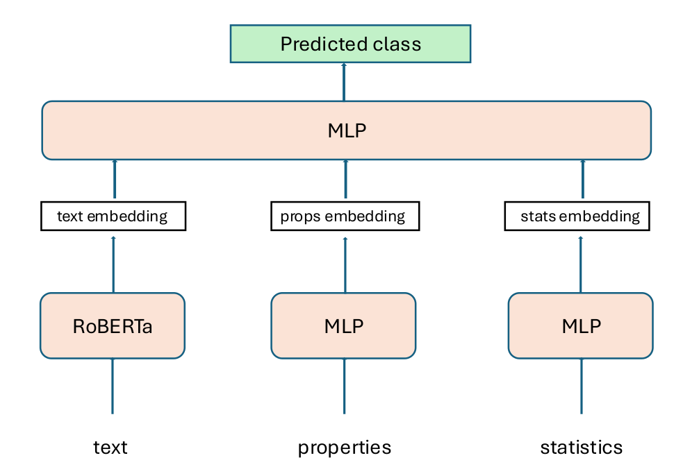

# Cultural Classification 

### What is culture?
Finding a formal definition of `culture` can be very hard (if not impossible), beacuse it is related to many aspects:
- Language
- Country (or even small regions)
- population 
- literature
- food 
- ... and so on.

However, in many NLP tasks, being able to "*detect*" different cultures can be extremely important to better understand the context, mitigate bias etc.

Therefore, as a first step to deal with this problem, it would be useful to have a system that could at least tell us if an item belongs to a specific culture or not.

In this repository, I formalize the problem as a multi-class classification porblem with the following labels:
- cultural exclusive
- cultural represnetative
- cultural cultural agnostic

As an example:
- Supplì: can be considered a cultural exclusive food of the italian culture (specifically of Rome) since I don't believe to be eaten in other parts of the World
- Sushi: can be considered cultural representative of the Japanese culture, but not cultural exclusive since it is consumed all around the world.
- Bread: can be considered cultural agnostic, since it does not belong to any specific culture. 

### Methodology

**Data**
The starting dataset was provided by the sapienza NLP group and it has the follwoing structure:
| item | name | description | type | hypernym | classification |
|------|------|-------------|------|----------|----------------|
|[link](https://www.wikidata.org/wiki/Q177) |pizza| Italian universal popular dish with a flat dough-based base and toppings | concept | food | cultural representative

where:
- item: link is the entry to the wikidata item's page
- name: name of the item
- type: can be a **named entity** (e.g. colosseum, Barck Obama ...) or a **concept** (man, car, flower)
- hypernym: is the category (literature, food, religion, politics, ...)
- classification: cultural agnostic, cultural representative, cultural exclusive

**Adding more informations to the original dataset**  
Before training any model I decided to enrich the original dataset, using two different approaches. First I expoited the wikidata knowledge-graph structure, identifying a set of relevant properties (29 in total) that could serve for the task and for each item, retrieved the corresponding values using SPARQL.

The second step was to retrieve statistical information (length, number of languages, etc.) form the wikipedia pages of each item. (thanks to [Alessandro](https://github.com/ErFonchio))

#### Model

The final dataset is composed of three different "types" of data:
- text: item's descirption
- Properties: wikidata's properties
- statistical information

Therefore I tried to use a strategy that combines the different data. To do so I trained three different models:
- **RoBERTa**: for dealing with text
- **MLP**: for dealinf with the properties
- **MLP**: for dealing with statistical information and some categorical features (type, category, subcategory)

All these were trained separately to perform the classification task, and then "combined" together in a final step. More precisely, I used:
- **RoBERTa** for extracting sentences embeddings
- the first **MLP** for building a "vectorized" representation of the properties
- the second **MLP** for building a "vectorized" representation of the statistical and some of the categorical information. 

Then, I combined all these feature embeddings to train the last **MLP**.

